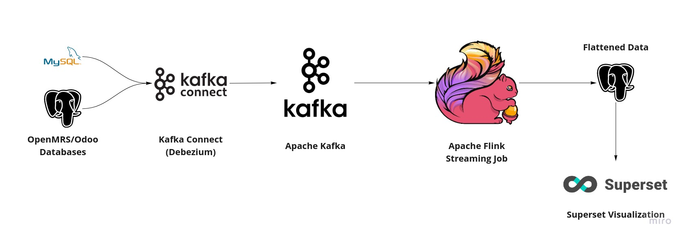
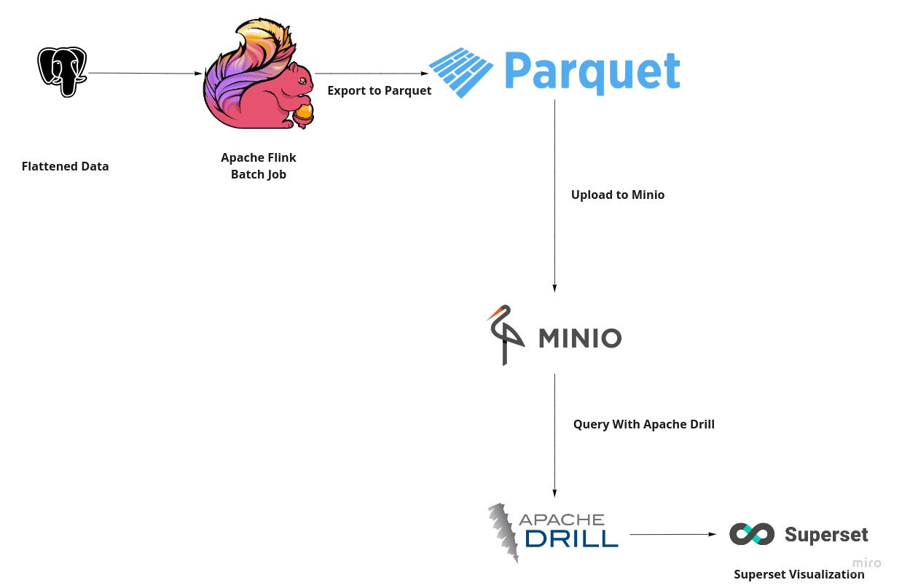

# Ozone Analytics
This project hosts Ozone Analytics suite.

It provides multiple services to cover different infrastructure needs:

- Running streaming and flattening data pipeline services only (without Superset)
- Running streaming, flattening pipelines and data visualization services (with Superset)
- Running a Drill-backed analytics server with MinIO service
- Running the Parquet export Flink job
The flattening pipelines themselves are composed of two Flink Jobs.

The first job is for handling the streaming data pipelines which use Kafka and Kafka Connect to stream OpenMRS data in a MySQL database into flattened tables in PostgreSQL.

The second Flink job is used for exporting flattened data generated by the streaming job into Parquet files for the purpose of moving the data into a centralised warehouse.

The project also includes MinIO for centralised Parquet files storage with Drill to query the data directly for MinIO.

The services have been split into multiple files which allows you to start only the services you need for example you could only be interested in starting the streaming data pipelines and not Superset or you may want to run  MinIO/Drill on a separate server and just upload parquet exported from remote data pipelines.

## Architecture

### Streaming analytics pipelines



### Centralized analytics



### To run

`git clone https://github.com/ozone-his/ozone-analytics`

The project assumes you already have an instance of Ozone FOSS or PRO installed and running. If you don't please refer to the [Ozone Docs] (https://docs.ozone-his.com) You will also need an instance of Ozone Pro Distro, you can use the helper script in the scripts folder.

To fetch the Distro:

```
cd ozone-analytics/scripts
```

```
./fetch-ozone-distro.sh 1.0.0-SNAPSHOT
```

This will fetch the distro and place it in the `ozone-analytics/scripts` folder under a subfolder `distro`. Once this distro is fetch go into the docker folder:

```
cd ../docker
```

### Export environment variables

#### Export the distro path

```bash
export DISTRO_PATH=../scripts
```

#### Export other environment variables

``` bash
export ANALYTICS_CONFIG_FILE_PATH=$DISTRO_PATH/distro/configs/analytics/config.yaml;\
export ANALYTICS_SOURCE_TABLES_PATH=$DISTRO_PATH/distro/configs/analytics/dsl/flattening/tables/;\
export ANALYTICS_QUERIES_PATH=$DISTRO_PATH/distro/configs/analytics/dsl/flattening/queries/;\
export ANALYTICS_DESTINATION_TABLES_MIGRATIONS_PATH=$DISTRO_PATH/distro/configs/analytics/liquibase/analytics/;\
export ANALYTICS_DB_PORT=5432; \
export CONNECT_MYSQL_PORT=3306; \
export CONNECT_MYSQL_USER=root; \
export CONNECT_MYSQL_PASSWORD=3cY8Kve4lGey; \
export CONNECT_ODOO_DB_PORT=5432; \
export CONNECT_ODOO_DB_NAME=odoo; \
export CONNECT_ODOO_DB_USER=odoo; \
export CONNECT_ODOO_DB_PASSWORD=password;\
export ODOO_DB_PORT=5432; \
export ODOO_DB_NAME=odoo; \
export ODOO_DB_USER=odoo; \
export ODOO_DB_PASSWORD=password;\
export OPENMRS_DB_PORT=3306; \
export OPENMRS_DB_NAME=openmrs; \
export EXPORT_DESTINATION_TABLES_PATH=$DISTRO_PATH/distro/configs/analytics/dsl/export/tables/; \
export EXPORT_SOURCE_QUERIES_PATH=$DISTRO_PATH/distro/configs/analytics/dsl/export/queries; \
export EXPORT_OUTPUT_PATH=./data/parquet; \
export EXPORT_OUTPUT_TAG=h1; \
export SUPERSET_CONFIG_PATH=$DISTRO_PATH/distro/configs/superset/ ; \
export SUPERSET_DASHBOARDS_PATH=$DISTRO_PATH/distro/configs/superset/assets/ ; \
export SQL_SCRIPTS_PATH=$DISTRO_PATH/distro/data
```

For Linux 

```bash
export ANALYTICS_DB_HOST=postgresql; \
export CONNECT_MYSQL_HOSTNAME=172.17.0.1; \
export CONNECT_ODOO_DB_HOSTNAME=172.17.0.1; \
export ODOO_DB_HOST=172.17.0.1; \
export OPENMRS_DB_HOST=172.17.0.1
```
For Mac and Windows

```bash
export ANALYTICS_DB_HOST=postgresql; \
export CONNECT_MYSQL_HOSTNAME=host.docker.internal; \
export CONNECT_ODOO_DB_HOSTNAME=host.docker.internal; \
export ODOO_DB_HOST=host.docker.internal; \
export OPENMRS_DB_HOST=host.docker.internal
```

The commands below should be run from the `ozone-analytics/docker` folder and assume you have the environment variables set.

### Start Ozone Analytics in Streaming mode

```bash
docker compose -f docker-compose-db.yaml -f docker-compose-migration.yaml -f docker-compose-streaming-common.yaml -f docker-compose-superset.yaml -f docker-compose-superset-ports.yaml up -d --build
```

### Start Ozone Analytics Batch mode

```bash
docker compose -f docker-compose-db.yaml -f docker-compose-migration.yaml -f docker-compose-batch-etl.yaml up
```

### Drill-backed analytics server

In cases where you have multiple instances of Ozone deployed in remote locations, you may want to process data onsite with the streaming and flattening pipelines but ship the data to a central repository for analytics. This provides a solution that uses:
* [Minio](https://min.io/ "Minio") - An S3-compatible object storage server.
* [Drill](https://drill.apache.org/ "Drill") - A Schema-free SQL Query Engine for Hadoop, NoSQL and Cloud Storage.
* [Superset](https://superset.apache.org/ "Superset") - Data exploration and data visualization tool.
* [Superset Worker](https://superset.apache.org/docs/intro "Superset Worker") - Run Superset background tasks.

To start this stack run;

```bash
docker compose -f docker-compose-db.yaml -f docker-compose-superset.yaml -f docker-compose-superset-ports.yaml -f docker-compose-minio.yaml -f docker-compose-drill.yaml up -d --build
```


### Running with helper scripts
The examples above are for running the services manually, we have included helper scripts to simplify the process of running the services. The helper scripts are located in the `scripts` folder. The scripts assume you have an Ozone instance running locally. If you don't follow the instructions [here](#to-run) section to start the services.
To run the services using the helper scripts you can follow the steps below from the root of the project.:

From the root of the project run the following commands:

```bash
cd scripts
```
Fetch the Ozone Pro Distro

```bash
./fetch-distro.sh 1.0.0-SNAPSHOT
```
Start the project with streaming pipelines

```bash
./start.sh
```

#### Parquet export using an OpenMRS database backup

-  Export the path to the distro
```bash
export ANALYTICS_CONFIG_PATH=<path_to_ozone>
```

- Run the flattening helper scripts to flatten and export the data

From the root of the project run the following commands:

```bash
cd scripts
```
Fetch the Ozone Pro Distro

```bash
./fetch-distro.sh
```

```bash
./scripts/run-batch-export.sh -m <path to openmrs dump> -d <path to odoo dump> -l <location tag>
```
:bulb: data folder should be found at `./docker/data/parquet` unless you set the -o  option for the script

#### Parquet export against an existing production deployment

- Run the batch ETL job to transform the data
```bash
docker compose -f docker-compose-db.yaml -f docker-compose-migration.yaml -f docker-compose-batch-etl.yaml up
```
- Export data in a Parquet format
```bash
docker compose -f docker-compose-export.yaml up
```
:bulb: data folder should be found at `./docker/data/parquet`

### Services coordinates
| Service  |   Access| Credentials|
| ------------ | ------------ |------------ |
| Kowl  |  http://localhost:8282 | |
| Flink  |  http://localhost:8084 | |
| Superset  | http://localhost:8088  | admin/password|
| Minio   | http://localhost:9000   |minioadmin/minioadmin123|
| Drill  |  http://localhost:8047 | |